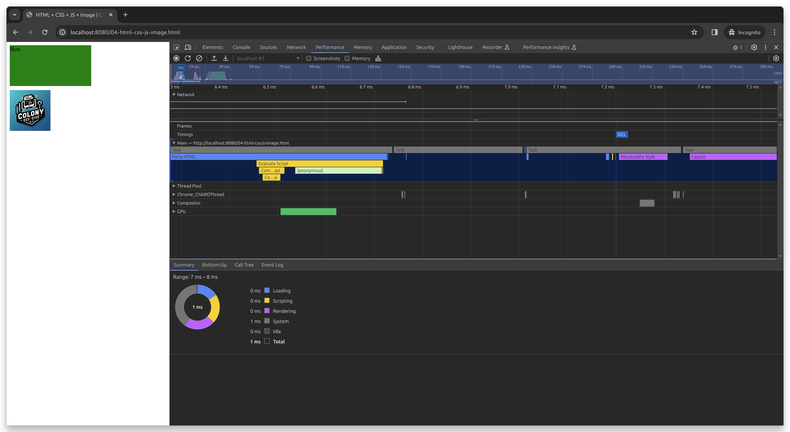

# Critical Rendering Path Analysis Showcase Aid

Simple websever and basic html pages to help aid using Chrome's DevTools to analyze the Critical Rendering Path of a webpage.

This was initially used to aid in one of [@joincolony](https://github.com/JoinColony)'s Dev Dive sessions presentation

